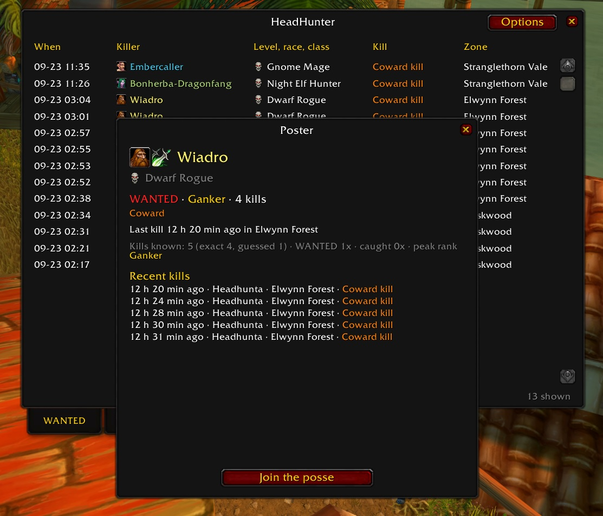
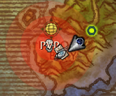

# HeadHunter - Wanted: Dead or Alive

**Got ganked? HeadHunter records who killed you, shares it with your faction and marks WANTED outlaws on the map. Form a posse and bring them to justice.**

For **Classic Era** and **WoW: Forever**.

## How it works

1. **An enemy player kills you.** HeadHunter saves who did it: name, level, class, race and zone. If more than one player attacked you, it saves all of them.
2. **Your report is shared** with every HeadHunter player of your faction.
3. **Gankers become WANTED.** An enemy who kills 4 players within 20 minutes gets a WANTED poster. Every HeadHunter sees the same list.
4. **Hunt them down.** You get an alert when a WANTED outlaw kills someone near you. Join the posse and go after them.
5. **Justice served.** When a HeadHunter, or anyone in their group, kills a WANTED outlaw, the outlaw is no longer WANTED for everyone.

## Features

### WANTED list and ranks
- An outlaw stays WANTED until a HeadHunter kills them, or until 7 days pass without a new kill.
- Ranks grow with kills: **Ganker**, **Outlaw**, **Desperado**, **Most Wanted** and **Dead or Alive**.

### Badges
Badges show *how* someone kills, not only how much:
- **Coward**: killed a player 10 or more levels lower, or a grey level player.
- **Duo**: killed a player together with one other enemy (2 vs 1).
- **Gang**: killed a player in a group of 3 or more.
- **Serial Killer**: 5 different victims in separate fights within a short time.
- **Gunslinger**: most kills were fair, one on one, at a similar level.
- **Giant Slayer**: killed higher level players alone.

Cowards are listed in the **Hall of Shame**.

### Alerts
- **WANTED sighting**: "WANTED Ganker X is here!" when a WANTED outlaw shows up on your screen, even in combat.
- **WANTED activity**: a WANTED outlaw killed someone near you. Click **Join the posse** or **Decline**. Only players close to the outlaw's level get this popup, the others get a chat line.
- **Justice served**: a message when a WANTED outlaw is brought down.
- **PvP hotspots**: Skirmish, Battle or Warzone when a big fight happens near you.

### World map
- A red **PVP** area shows where fights are happening. It gets darker as the fight grows and stays for 20 minutes after the last fight.
- A **skull** shows where a WANTED outlaw made their last kill (for 10 minutes).

### HeadHunter window
Type `/hh` or click the minimap button:
- **WANTED**: everyone who is WANTED now, sorted by rank, kills or last kill.
- **Hall of Shame**: every known coward.
- **High Noon**: the best duelists, with a switch between the Alliance and Horde lists.
- **My deaths**: who killed you, when and where.
- **My marks**: your hunter points and rank.

Hover a name for details, or click it to open the outlaw's **poster**: race and class, rank, badges, recent kills, posse and a **Join the posse** button.

### Enemy tooltips
Mouse over an enemy player to see if they are WANTED, their rank, kills and badges. Any player with duels also shows their High Noon rank.

### Posse and hunter ranks
- Join a posse to hunt an outlaw together. Posse members see each other.
- Earn **marks**: +1 for joining a posse, and +3 to +20 when you or your group bring down a WANTED outlaw (more for higher ranks). Declining costs 1 mark.
- No marks for hunting players 10 or more levels below you. Hunting down is ganking too.
- Hunter ranks: **Tracker**, **Bounty Hunter**, **Manhunter**, **Headhunter** and **Reaper**.

### Catch-up
When you log in, HeadHunter asks other HeadHunters what you missed while you were offline, so your WANTED list is up to date.

### High Noon (duels)
- Classic Era: every duel next to a HeadHunter counts, even when the duelists do not use the addon. WoW Forever: duels count when one of the duelists uses HeadHunter. Running away counts as a loss.
- Only duels between players of level 10 or higher, at most 5 levels apart, count. Beating lowbies does not help.
- Duels are shared like death reports, and never make anyone WANTED.
- A rating for every duelist (starts at 1000). You are listed after 5 duels.
- Ranks: **Greenhorn** (under 5 duels), **Quickdraw**, **Sharpshooter**, **Deadeye** and **Legend**. The best duelist of each faction is the **Top Gun**.

## Commands

| Command | What it does |
|---|---|
| `/hh` | Open the HeadHunter window |
| `/hh help` | List all commands |
| `/hh options` | Open the options page |
| `/hh wanted` | WANTED list in chat |
| `/hh outlaw <name>` | Details about one enemy |
| `/hh deaths` | Your recent PvP deaths |
| `/hh posse` | Who is hunting which outlaw |
| `/hh marks` | Your hunter rank and marks |
| `/hh hotspots` | PvP activity per zone |
| `/hh duels` | High Noon: the best duelists and your rank |
| `/hh map on/off` | PvP areas and skulls on the world map |
| `/hh tooltip on/off` | WANTED line on enemy tooltips |
| `/hh minimap` | Show or hide the minimap button |
| `/hh catchup` | Ask other HeadHunters what you missed |

All settings are also on the options page: **Esc > Options > AddOns > HeadHunter**.

## Good to know

- **Classic Era:** reports go to your guild and group automatically. To reach every HeadHunter on the realm, click **Report** after a death (or type `/hh report`). The same goes for **Announce** after you bring down an outlaw (`/hh justice`). The game only allows these realm-wide messages after a click.
- **Classic Era** has no map waypoints, so HeadHunter tells you the coordinates in chat instead.
- **WoW: Forever** shares everything automatically.
- **WoW: Forever is in testing mode.** The Forever client does not load saved data back (a known client issue, not a HeadHunter bug), so your lists and settings reset on every reload or login. Catch-up handles it: when you log in, other HeadHunters send back what you missed, so your lists refill from the realm. HeadHunter tells you this in chat when you log in on Forever.
- HeadHunter is off in dungeons, raids and battlegrounds. Duels never count as PvP kills.
- The more players use HeadHunter, the better it works. Tell your guild!
